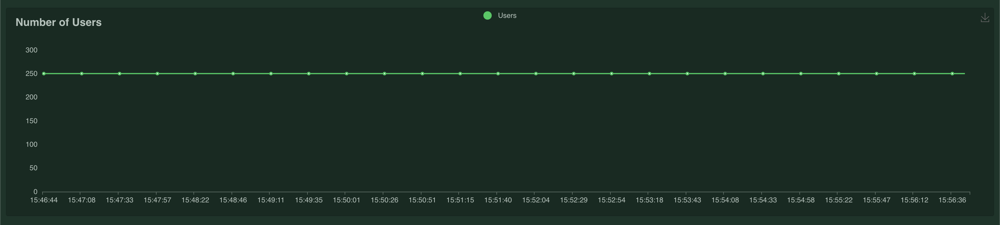
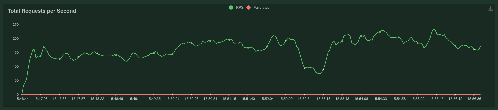
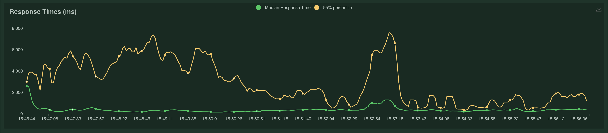

# Stress Test Phase 10 June 2022

Tests the performance of Survey Runner, hosted on AWS. Comparisons are made with [Questionnaire Runner's December 2021 data](https://github.com/ONSdigital/eq-survey-runner-benchmark/blob/master/doc/performance-testing/cloud-run/0001_stress-test-december-2021.md), hosted on GCP.

All performance tests were run against a temporary environment hosted on AWS, created for the purpose of providing accurate test results. The environment was created following the [EQ Author Terraform](https://github.com/ONSdigital/eq-author-terraform) repository's README documentation.

## Benchmark settings

| Setting              | Value                        |
| -------------------- | ---------------------------- |
| Clients per instance | 250                          |
| Clients spawn rate   | 50                           |
| Wait time minimum    | 1                            |
| Wait time maximum    | 2                            |
| Requests JSON        | test_benchmark_business.json |
| Runtime              | 10m                          |
| Load injectors       | 1                            |

## Results

| Percentile | Response Time (ms) |
| ---------- | ------------------ |
| 50th       | 330                |
| 90th       | 1207               |
| 95th       | 2340               |
| 99th       | 6322               |
| 99.9th     | 11293              |

| Request type | Percentile | Response Time (ms) |
| ------------ | ---------- | ------------------ |
| GET          | 99th       | 5615               |
| POST         | 99th       | 7264               |

**Total Requests: 101,099**

**Total Failures: 45**

**Error Percentage: 0.04%**

## Visualisations

---

_Represents the number of users at each specified time_

---

_Represents the number of requests per second at each specified time_

---

_Represents the response time in milliseconds at each specified time_

---

## Conclusion

There is a strong correlation between the application's response time and the number of requests per second - as response time increases, the number of requests per second decreases.

## Comparisons

At 15:49:23, the number of requests per second was 134.5. The median response time at this time was 360ms, and the 95th percentile was 5300ms. This data can be compared with similar data from Questionnaire Runner (v3) - when v3's number of requests per second was similar (135.18), its response time's 99th percentile was considerably lower than v2's 95th percentile (390ms against 5300ms).

It can be deduced that v3's 99th percentile response time will always be greater than v3's 95th percentile, since a 99th percentile always represents a value greater than or equal to a 95th percentile in this data set. Therefore, based on v3's response time's 99th percentile being faster than v2's 95th percentile for similar data, it is certain that GCP performed better than AWS for similar numbers of requests per second in this case.

Similar data can be found throughout the results, and the response time's 95th percentile on AWS is consistently higher than GCP's 99th percentile. Therefore, the data suggests that in all cases run during this study, GCP's performance is considerably greater than AWS' performance.
